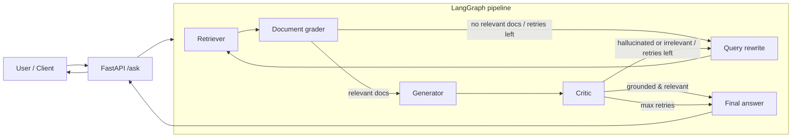

# Self-Healing Agentic RAG

**Reliability-first retrieval with autonomous error correction.**

[](https://www.python.org/)
[](https://fastapi.tiangolo.com/)
[](https://langchain-ai.github.io/langgraph/)
[](https://streamlit.io/)
[](LICENSE)

> **Portfolio project** by a Data Science & AI Engineer — designed so an SRE or platform team can reason about deployment, observability, and operational boundaries without reverse-engineering the repo.

---

## The “why”: brittle RAG vs. self-healing RAG

**Brittle RAG** fails in predictable ways: noisy retrieval surfaces irrelevant chunks, the generator “fills gaps” with plausible fiction, and a single bad hop poisons the user experience. Traditional stacks often treat these as **one-shot** pipelines—there is no closed loop to **detect** failure modes or **recover** before the answer is shown.

This system implements **self-healing agentic RAG**: the graph **grades** retrieved documents, **rewrites** the query when context is weak, **generates** from filtered context, and runs a **critic** that separates **groundedness** from **answer relevance**. When the critic flags hallucination or irrelevance (within a bounded retry budget), the workflow **loops** through query refinement and re-retrieval—**autonomous error correction** aimed at **reliability**, not cosmetic polish.

---

## Architecture

High-level control flow (LangGraph state machine):



**Operational note:** Langfuse tracing is wired into node-level LLM calls for **full request observability** (latency, spans, and evaluation scores where published).

---

## Key features

| Capability | What it delivers |
|------------|------------------|
| **Self-correction** | Autonomous **query rewriting** and **document grading** before generation; bounded **retry** loop instead of a single fragile pass. |
| **Structured output** | **Pydantic** schemas (e.g. grading and critic verdicts) for **deterministic** branching—routers consume booleans/structured fields, not brittle free text. |
| **Observability** | **Langfuse** integration for traces and scores; suitable for SRE dashboards and incident correlation. |
| **Cost efficiency tracking** | Explicit **retry_count** surfaced in the API and UI; **efficiency** metric \( \frac{1}{1 + \text{retries}} \) quantifies the operational “tax” of healing (see [Evaluation metrics](#evaluation-metrics)). |

---

## Tech stack

| Layer | Technology |
|-------|------------|
| **LLM (generation & grading)** | Google **Gemini** via LangChain (`ChatGoogleGenerativeAI`); pipeline model configurable in `src/config.py` — **Gemini 3 Flash** recommended for 2026-class latency/cost. |
| **Embeddings & vector DB** | **Google Generative AI Embeddings** + **Pinecone** (serverless-compatible client; index `self-healing-rag`). |
| **Orchestration** | **LangGraph** (`src/graph.py`) — compiled graph singleton consumed by API and evaluators. |
| **API** | **FastAPI** (`src/api.py`) — `POST /ask`, `GET /health`. |
| **UI** | **Streamlit** (`app.py`) — chat + process trace; optional **Gemini 3 Flash** executive summary of the run. |
| **Evaluation** | **RAGAS** (`tests/evaluator.py`) — faithfulness & answer relevancy; scores pushed to Langfuse. |

---

## Installation & setup

### Prerequisites

- Python **3.11+**
- Accounts & keys: **Google AI (Gemini)**, **Pinecone**, **Langfuse**

### 1. Clone and virtual environment

```bash
git clone <your-fork-or-mirror-url>
cd portfolio_2

python -m venv .venv
# Windows
.venv\Scripts\activate
# macOS / Linux
source .venv/bin/activate

pip install -U pip
pip install -r requirements.txt
```

### 2. Environment variables

Create a **`.env`** file at the **project root** (same level as `requirements.txt`). The app loads it from `src/config.py`.

| Variable | Purpose |
|----------|---------|
| `GOOGLE_API_KEY` | Gemini / Google Generative AI |
| `PINECONE_API_KEY` | Pinecone |
| `PINECONE_INDEX_HOST` | Pinecone index host URL |
| `LANGFUSE_PUBLIC_KEY` | Langfuse public key |
| `LANGFUSE_SECRET_KEY` | Langfuse secret key |
| `LANGFUSE_HOST` | Langfuse base URL (e.g. cloud region) |

**Example (placeholder values — do not commit secrets):**

```env
GOOGLE_API_KEY=your_key
PINECONE_API_KEY=your_key
PINECONE_INDEX_HOST=https://your-index-xxxx.svc.pinecone.io
LANGFUSE_PUBLIC_KEY=pk-lf-...
LANGFUSE_SECRET_KEY=sk-lf-...
LANGFUSE_HOST=https://cloud.langfuse.com
```

To align the **graph** with **Gemini 3 Flash**, set the model in `src/config.py` (`Settings.llm_model`, e.g. `gemini-3-flash`). The evaluator and Streamlit summary paths already target **Gemini 3 Flash** where applicable.

### 3. Vector index

Ensure a Pinecone index named **`self-healing-rag`** exists and is populated with your corpus (dimensions and embedding model must match `src/retriever.py`).

---

## Evaluation metrics

| Metric | Role | Definition in this project |
|--------|------|---------------------------|
| **Faithfulness** (RAGAS) | Did the answer stay **grounded** in retrieved context (hallucination signal)? | Computed in `tests/evaluator.py` via RAGAS `faithfulness`; judge LLM uses **Gemini 3 Flash**; results can be recorded as Langfuse scores. |
| **Answer relevancy** (RAGAS) | Did the answer **address the question**? | RAGAS `answer_relevancy` in the same evaluator. |
| **Cost efficiency** | Penalize extra **self-healing** iterations | \( \textbf{Efficiency} = \dfrac{1}{1 + \text{retries}} \) — **1.0** = first-pass success; each increment of `retry_count` reduces the score (e.g. 3 retries → \( 1/4 = 0.25 \)). |

Run the evaluation suite from the **repository root**:

```bash
python -m tests.evaluator
```

This keeps `src.*` imports resolvable. If your environment requires an explicit path:

```bash
# PowerShell (repository root)
$env:PYTHONPATH = (Get-Location).Path
python tests/evaluator.py
```

---

## Usage

### Run the FastAPI backend

```bash
uvicorn src.api:app --host 0.0.0.0 --port 8000
```

- **Ask:** `POST http://127.0.0.1:8000/ask` with JSON `{"question": "..."}`  
- **Health:** `GET http://127.0.0.1:8000/health`

### Run the Streamlit frontend (second terminal)

```bash
set RAG_API_BASE=http://127.0.0.1:8000
streamlit run app.py
```

On Linux/macOS: `export RAG_API_BASE=http://127.0.0.1:8000`

The UI calls the API with `requests` and shows a **process trace** (retrieval, hallucination flag, healing attempts, verification state). Sidebar metrics prefer **Langfuse** score aggregates, with a local **`.cache/project_metrics.json`** fallback.

---

## Operations & deployment (SRE-oriented)

- **Process model:** stateless API + external Pinecone + external Langfuse; scale API replicas horizontally; ensure **one embedding model / index schema** across environments.
- **Health:** use `GET /health` for load balancer and Kubernetes readiness/liveness probes.
- **Secrets:** inject via your secret manager into env vars; **never** commit `.env`.
- **Timeouts:** Streamlit and `requests` use generous timeouts for long graph runs; tune per SLA.
- **Observability:** Langfuse traces align with graph nodes; correlate **retry_count** and RAGAS scores for cost-quality tradeoffs.

---

## Repository map

| Path | Purpose |
|------|---------|
| `src/graph.py` | LangGraph definition and compiled `graph` |
| `src/nodes.py` | Nodes, `GraphState`, Pydantic verdict models |
| `src/retriever.py` | Pinecone + embeddings |
| `src/config.py` | Settings, Langfuse callback, LLM factory |
| `src/api.py` | FastAPI service |
| `app.py` | Streamlit demo |
| `tests/evaluator.py` | RAGAS + Langfuse score publishing |

---

## License

Specify your license in `LICENSE` (badge above assumes MIT if you add that file).

---

*Built as a **portfolio** showcase of **production-minded** agentic RAG: reliability, observability, and measurable cost of self-healing.*
"# Self-Healing-RAG-Pipeline" 
